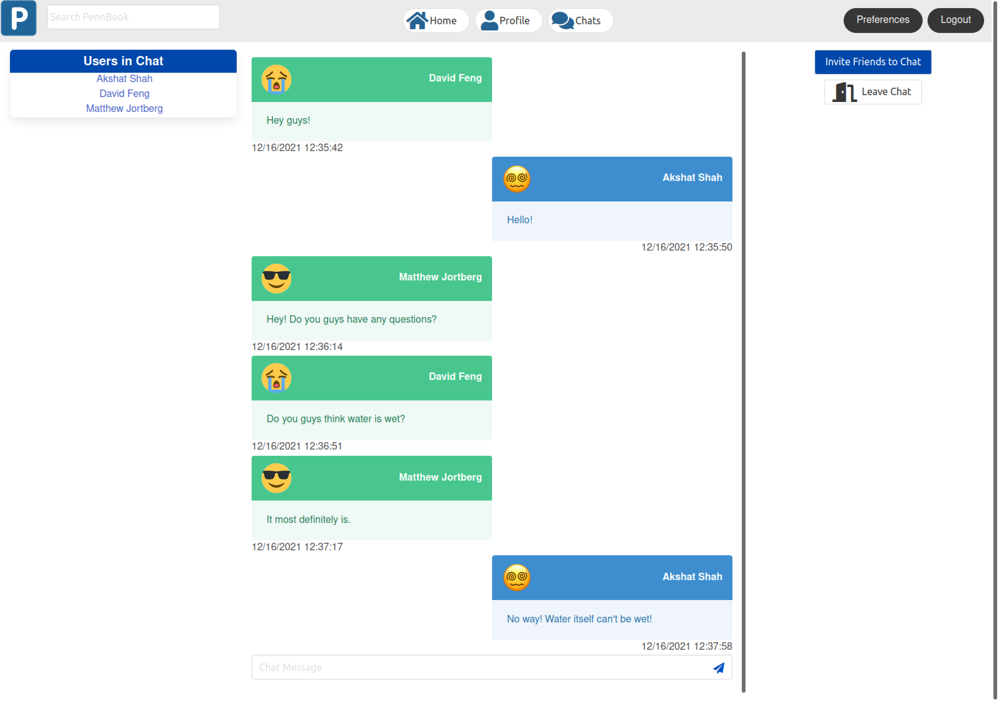
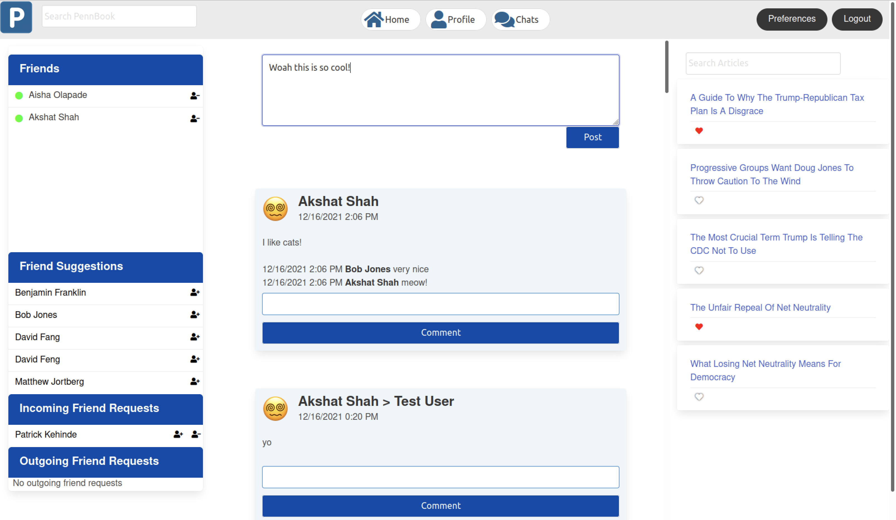

<div id="top"></div>

<h1 align="center">PennBook</h1>
<h3 align='center'>David Feng, Patrick Kehinde, Aisha Olapade, and Akshat Shah</h3>


<!-- TABLE OF CONTENTS -->
<details>
  <summary>Table of Contents</summary>
  <ol>
    <li>
      <a href="#about-the-project">About The Project</a>
      <ul>
        <li><a href="#built-with">Built With</a></li>
      </ul>
    </li>
    <li>
      <a href="#getting-started">Getting Started</a>
      <ul>
        <li><a href="#prerequisites">Prerequisites</a></li>
        <li><a href="#installation">Installation</a></li>
      </ul>
    </li>
    <li><a href="#usage">Usage</a></li>
    <li><a href="#roadmap">Roadmap</a></li>

  </ol>
</details>


<!-- ABOUT THE PROJECT -->
## About The Project

We began by implementing a general login and signup that authenticates users. When a user is authenticated, it persists until they sign out or if an hour passes without the user submitting any request to the server that requires the user to click on something. At any point while logged in a user can change their password, affiliation, interests, email, profile picture, or privacy settings. A private user’s posts can only be viewed by friends, whereas a public user’s posts can be viewed by everyone. A user is allowed to send friend requests to other users. These users can then choose to accept or reject the request as well. Additionally, users can post on their own wall and their friends' walls. These users can see these posts and see what wall a user has posted on. There are also two search features: news and users. Users can search for other users as well as new articles. Furthermore, users have news recommendations on the homepage based on an absorption algorithm. Finally, there is a chat feature between friends that includes creating a group chat as well as leaving a chat. 

## Description of Technical Features

The login page authenticates a user and logs them in, this login state is updated in the tables and persists either until the user logs out, or until one hour has passed without the user clicking on anything, after which the app will automatically log the user out. In order to ensure security, we hashed passwords using SHA-256 so that only the user knows their password. Furthermore, form content is saved between unsuccessful submissions in the cookies, and these are cleared as a page is reloaded so that the content is never preserved after the page reloads. 

The signup page allows users to fill in their information and create an account, and won’t let the user sign up if a field is left blank, less than two interests have been selected, or if their chosen username is already being used by someone else in the system. Once the account is created, the user is logged in and our newsfeed algorithm is run via a shell command in EC2, which downloads maven and then uploads a job to Livy. The Livy URL in AdsorptionJob.java under the newsfeed directory must be changed every time a new EMR cluster is created.

The home page is displayed by querying for online/offline friends, friend suggestions based on affiliation, incoming/outgoing friend requests, article recommendations, and posts. After obtaining this information, we use them to render styled html components onto the page. For friend suggestions, we suggest up to five people of the same affiliation by querying a table of users partition keyed by affiliation. For posts we query a table of posts partition keyed by poster, so that we get all posts made by the logged in user and all posts made by their friends.  In the frontend we determine the type of each post (a friend relationship creation, update to affiliation/interest, status update, etc) and display the content depending on the type of post, since for example an update to affiliation is not technically a post to a user’s wall, so it must be displayed differently. Each of these posts has a corresponding post id in our table, so we can map all of the comments for any post to the post by putting the post id as that comment’s partition key. So for each post we query out all comments that have this post’s id as its partition key, and then we load the result of the query as the comments for that post. 

Each user has their own wall, which is implemented similarly to the home page. The posts on a wall are those that were posted specifically to that wall, so we also maintain a separate post table partition keyed by the wall of the current post, so that we can query it by this wall’s user to get all of the posts on a user’s wall. If a user’s privacy setting is public, we load all posts that were posted to their wall, and if a user’s privacy setting is private we only load posts if the current user is one of their friends. If the current user is a friend of the wall user, the wall also contains a form allowing you to make a post on the wall. If the current user isn’t friends with the wall user, then we choose to display buttons that, based on the current relationship between the wall user and the current user, either send a friend request, undo a friend request, or accept/reject a friend request. Each user’s wall links to the friend visualizer for that user, which functions exactly as required: at first only a user’s friends are displayed, and if we click on a user, their friends that are of the same affiliation as the original user are added to the graph.

The user search bar allows users to search for other users by their full name, and contains an autocomplete feature that makes a call to a table storing up to 10 prefixes for every possible prefix of the names of every user that has signed up for the app (as described on Piazza). This autocomplete displays these users in a dropdown list under the search bar. This feature removes the need to scan the users table during searches, and the limit of 10 users per prefix is defined because this is reasonably the maximum possible users that the frontend can display. This approach helps ensure a more scalable design. 

The preferences page autocompletes some of the preexisting data for each user such that they can change and update it. After a user changes some data, the new values overwrite the previous values in the tables storing user information. Profile pictures that are added/updated are stored in a public S3 bucket that we use to store and display these images. When a user adds an image, we can access it through a public link. Not only does this make it easier for us to access an user's image, but it makes sense to make this public as any user should be able to see someone's profile picture. If a new image is uploaded the old image is overwritten. If interests are updated on this page, the newsfeed algorithm triggers and runs in the background on Livy, without slowing down the page.

The chat feature allows users to send chat invites to online friends. We query a user's friends and check who is online, which are the same users we can send private chat requests to. If a user accepts a private chat request, a new private chat is created and added to the table. We store chat rooms in a chatrooms table that is partitioned by the id of the chat, and contains chat id to username pairings that represent that user in the chat with that id. This also allows us to very easily map the messages in a chat to the id of the chat, so we can simply query all of the chats in the chats table by the id of the chat room for persistence of messages. The status of whether or not a chat is a group chat is stored in the group_chat table, so we can query to see whether or not a chat is a group chat. Within a private chat if a user adds another user, we create a new group chat containing these members, and if a user is added to an existing group chat, we simply add them to that group chat without making a new one. Private chats are immediately deleted if either user leaves, since in a private chat setting if someone leaves they are trying to permanently end conversation with the other person, but in group chats the chat persists until all users have left. If you send a message in any type of chat, we add the message to our tables and then emit the message using socket.io.

In general for news articles, you are able to both view them, click on their headlines to go to the actual news articles, and like and unlike them by clicking on the heart. You can search for news articles in the news article search bar on the home page, and the top 5 scored articles from any run of the algorithm are displayed as recommended on the home page as well. Every time the algorithm is run, we also take the current 5 articles on the page and send them to an already_recommended table, which we query when making suggestions, so that after running the page does not recommend these articles again.

An important component to note is storing the reversal of some tables. Given any dataset we want to access (say the users of our app), we are able to query the items within our table by their primary key, but we aren’t able to query by any of the columns (which we do need to do in some instances like querying by affiliation for the friend visualizer and friend recommendations). To fix this, we decided to store duplicate tables of certain data into other tables partitioned by different columns of the data, replicating that data in a manner similar to what was discussed on Piazza to avoid the possibly massive operation of scanning the table, improving scalability.

As has been previously mentioned, we only persistently store information that is already public like affiliation, username, and full name in the cookies of our session, ensuring security. Additionally, all data for our application is stored on DynamoDB, and our newsfeed algorithm runs on Apache Livy, both of which are very scalable, thus our implementation is scalable.

## Adsorption Algorithm 

As a general note, the route for the newsfeed algorithm that runs whenever a user updates an interest runs a shell script that is specifically designed to download maven on EC2, so if you run it locally it won’t do anything. This script takes a while upon running for the first time on a new cluster because it needs to download maven. In order to run locally, simply cd to the newsfeed directory, and then run mvn package, and then mvn exec:java@loader

First, we scanned tables to get each edge in the graph, then we will use the adsorption algorithm on: the friends table for Friend relationships, the articles table for categories, the interests table for user interests, and the articleLikes table for article likes. Then, using a combination of the reduceByKey and mapToPair operations we made a series of node transfer RDDs to show the specified distribution of weight across each type of edge. By joining the PairRDDs for edges and node transfers we made EdgeTransfer RDDs that hold the source, destination, and edge weight. We merge all the EdgeTransfer RDDs of the different edge types to make one huge EdgeTransferRDD. We initialize a label weight RDD such that the only labels that exist are the nodes representing users having their own name as a label with a score of 1. At this point all other label node pairings would have a score of 0. We consistently update propagate RDDS to model the push of label weight scores throughout 15 iterations (if convergence is not met before). Every round the label weights are normalized, making the sum of the scores 1. If the previous weight and the updated weight does not have a disparity greater than 0.15, then we say this has converged. At the end we load the article score for user to article pairings to userArticleScores table.


<p align="right">(<a href="#top">back to top</a>)</p>

### Built With

* [Async](https://caolan.github.io/async/v3/)
* [AWS SDK](https://github.com/aws/aws-sdk-js).
* [Express](https://expressjs.com/).
* [JQuery](https://jquery.com/)
* [Bulma](https://bulma.io/)
* [EJS](https://ejs.co/).
* [Cookie Parser](https://github.com/expressjs/cookie-parser#readme)
* [Socket.io](https://socket.io/)
* [UUID](https://github.com/uuidjs/uuid#readme)
* [sjcl](https://github.com/bitwiseshiftleft/sjcl)
* [LRU Cache](https://github.com/isaacs/node-lru-cache#readme)
* [Stemmer](https://github.com/words/stemmer)
<p align="right">(<a href="#top">back to top</a>)</p


<!-- GETTING STARTED -->
## Getting Started
To get a local copy up and running follow these simple example steps.

### Prerequisites

Setup DynamoDB Tables

* npm

```sh
npm install npm@latest -g
```

### Installation

1. Clone the repo
   ```sh
   https://github.com/akshatmshah/PennBook
   ```
2. Go to the cloned directory
   ```sh
   cd PennBook
   ```
4. Install dependencies 
   ```sh
   npm install
   ```
 <p align="right">(<a href="#top">back to top</a>)</p>


<!-- USAGE EXAMPLES -->
## Usage

1. Use the following to **run**  the Application
   ```sh
   node app
   ``` 
  
 2. To change the port navigate to app.js.
 
  #### Homepage


  #### Chat
 
 

<p align="right">(<a href="#top">back to top</a>)</p>

